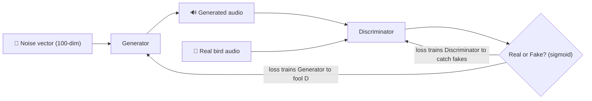
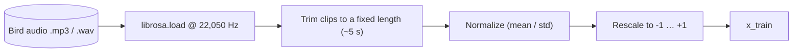
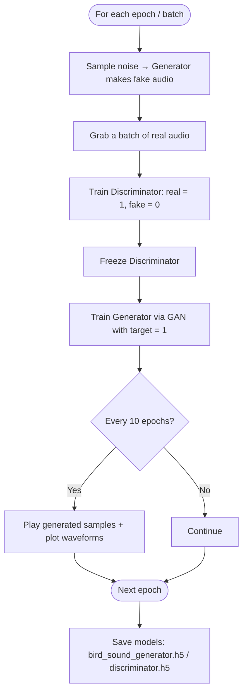

# 🐦 Bird Sound Generator using GANs

A deep‑learning project that **generates synthetic bird songs** using a **Generative Adversarial
Network (GAN)**. Real bird recordings (the *Alder Flycatcher*, `aldfly`, from a Kaggle bird‑song
dataset) are loaded as raw audio waveforms, and a GAN learns to produce brand‑new audio clips that
sound like the training birds.

The full implementation lives in the notebook
[`Sound Generation using GANs.ipynb`](Sound%20Generation%20using%20GANs.ipynb).

---

## 🧠 What is a GAN?

A GAN pits two neural networks against each other. The **Generator** turns random noise into fake
audio; the **Discriminator** tries to tell real recordings from fakes. As they compete, the
Generator gets better at producing realistic bird sounds.



---

## 🔄 Data Pipeline

Audio is loaded with **Librosa**, trimmed to a fixed length, then normalized and rescaled to the
`-1 … +1` range the network expects.



---

## 🏗️ Model Architecture

| Network | Layers | Notes |
|---------|--------|-------|
| **Generator** | Dense `512 → 512 → 1024 → 1024 → audio_length` with **ReLU** | Input = 100‑dim noise; Adam(lr=1e‑4, β₁=0.5) |
| **Discriminator** | Dense `1024 → 512 → 256 → 1` with **ReLU** + **Dropout(0.4)** | Sigmoid output = real/fake probability |
| **GAN** | Generator → (frozen) Discriminator | Trains the generator to fool the discriminator |

---

## 🏋️ Training Loop



The notebook trains for **50 epochs** with a **batch size of 32**, records generator/discriminator
losses, and periodically renders playable audio samples plus waveform plots so you can hear and see
the model improve.

---

## 🧰 Tech Stack

The notebook utilizes the following technologies and libraries:

1. **NumPy** — numerical computations
2. **Pandas** — data manipulation and analysis
3. **Librosa** — audio loading, processing, and analysis
4. **Matplotlib** — plotting and visualization (waveforms, loss curves)
5. **IPython** — interactive audio playback in the notebook
6. **Warnings** — suppressing warning messages
7. **Glob** — file‑path matching and searching
8. **Time** — measuring execution time
9. **OS** — interacting with the file system
10. **Keras**
    - `Dense`, `Dropout`, `Input`, `ReLU` — neural‑network layers & activation
    - `Model`, `Sequential` — Functional API & Sequential model builders
    - `Adam` — optimization algorithm
    - `models` — saving/loading deep‑learning models
11. **Scikit‑learn** — splitting datasets into training and testing sets

---

## 🚀 Getting Started

### Prerequisites
```bash
pip install numpy pandas librosa matplotlib ipython scikit-learn tensorflow keras
```

### Run it
1. Open `Sound Generation using GANs.ipynb` in **Jupyter** or **VS Code**.
2. Update the audio paths to point at your bird‑song dataset (e.g. the Kaggle *Bird Song* data).
3. Run the cells top‑to‑bottom to preprocess audio, build the GAN, train, and generate new sounds.

> 💡 An `Example Test Audio.mp3` sample and a `GAN Sound.pptx` presentation are included for
> reference.

---

## 🗂️ Project Structure

```
Bird-Sound-Generator/
├── Sound Generation using GANs.ipynb   # End-to-end GAN pipeline
├── Example Test Audio.mp3              # Sample input audio
└── GAN Sound.pptx                      # Project presentation
```

---

## 💡 Possible Enhancements
- Use **convolutional** layers (DCGAN / WaveGAN) for higher‑fidelity audio
- Train on spectrograms instead of raw waveforms
- Add more bird species and condition generation on the species label (conditional GAN)
- Longer training with checkpointing and audio‑quality metrics

---

> Built to explore generative deep learning applied to audio — turning random noise into
> bird‑like sounds through adversarial training.
